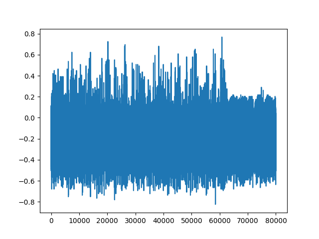

The TinyAES dataset is a dataset of power-measurements of a textbook [AES
(Wikipedia)](https://de.wikipedia.org/wiki/Advanced_Encryption_Standard)
implementation. It was introduced for the DefCon 27 demo: [A Hacker Guide To
Deep Learning Based Side Channel
Attacks](https://elie.net/talk/a-hackerguide-to-deep-learning-based-side-channel-attacks).
In this tutorial we show how to convert the original data into the sedpack
format.

## Original Dataset

The dataset was captured from STM32F4 chips using the ChipWhisperer [CW308 UFO
board](https://www.newae.com/chipwhisperer). The capture was asynchronous
meaning that the oscilloscope clock signal and the target chip clock signal
were not synchronized (oscilloscope was oversampling to cope with this fact).
The oscilloscope used was PicoScope&reg; 6404D.

One can download all zipped files either by clicking the following link
[datasets.zip
(8.2GB)](https://storage.googleapis.com/scaaml-public/scaaml_intro/datasets.zip)
or:

```bash
wget https://storage.googleapis.com/scaaml-public/scaaml_intro/datasets.zip
sha256sum datasets.zip  # 4bf2c6defb79b40b30f01f488e83762396b56daad14a694f64916be2b665b2f8 
unzip datasets.zip
```

The original files were saved in the
[NumPy](https://numpy.org/doc/1.26/reference/generated/numpy.savez.html)
format. Each file having a constant key and balanced plaintexts (see [SCAAML
Attack Point
Iterators](https://google.github.io/scaaml/guides/capture/attack_point_iterators/)
for explanation). This is completely fine other than:

-   There is no standard format -- if somebody wants to experiment with this
    dataset they have to discover the data format and code custom data loaders.
    Not complicated but tedious.
-   This approach does not scale well for huge datasets.

## Conversion to Sedpack

The script
[docs/tutorials/sca/tiny_aes.py](https://github.com/google/sedpack/blob/main/docs/tutorials/sca/tiny_aes.py)
contains a function `convert_to_sedpack` which takes the directory with
original NumPy files and converts it to a sedpack dataset.

We save the following attributes:

-   `trace1`: float16, length 80_000
-   `key`: uint8, length 16
-   `plaintext`: uint8, length 16
-   `ciphertext`: uint8, length 16
-   `sub_bytes_out`: uint8, length 16
-   `sub_bytes_in`: uint8, length 16

Some (most) of our scenarios will be dealing with profiled attacks. Where
during the profiling phase we know the secret (`key`) and during attack we try
to find it out. For convenience we also save the `ciphertext` (result of
encryption of the given `plaintexts` by the `key`) and first round of AES S-BOX
inputs and outputs. These are for convenience and we could omit those. In a
profiled setting (one device where we train -- profiling phase and another
device where we attack -- attack phase) `ciphertext`, `sub_bytes_in`,
`sub_bytes_out` could be considered to be redundant information. In the
non-profiled setting (single device where we do not know the `key`) we would
have access only to `plaintext` and `ciphertext`.

Naturally if we wanted to save more attack points, e.g., last round of AES
states, all inputs of the S-BOX, we could. Alternatively we can choose to
compute those on the fly when / if we need them.

The limitation of the TinyAES dataset is that all data was collected on a
single device (both the original `train` and `test` splits). This is one of the
reasons why this dataset is suitable for demonstration purposes only when one
is considering profiled attacks. In a realistic scenario one would take `train`
and `test` on the profiling chip and `holdout` on a different physical device
(of the same type). We deal with the lack of the `holdout` split by splitting
the original `test` into `test` and `holdout`.

### Iteration

Let us check the data we just converted.

```python
from sedpack.io import Dataset

dataset = Dataset("tiny_aes_sedpack")
for example in dataset.as_numpy_iterator(split="train",
                                         shuffle=0,
                                         repeat=False):
    print(example["key"])
```

We should see groups of 256 examples with the exactly same `key` value. Same
holds for `test` and `holdout` splits.

And we plot a single trace just to be sure everything works as expected.

```python
import matplotlib.pyplot as plt

# Plot a single trace.
plt.plot(next(iter(dataset.as_numpy_iterator(split="train")))["trace1"])
plt.savefig("tiny_aes_trace.png")
```


