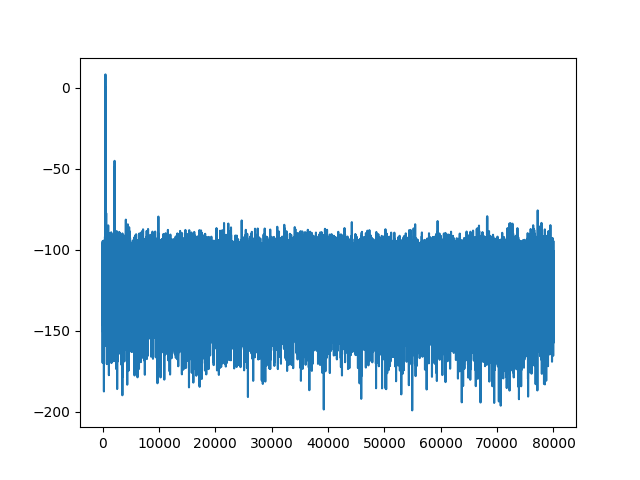

import { Tabs, TabItem } from '@astrojs/starlight/components';

The **Signal to Noise Ratio (SNR)** (see [Signal-to-noise ratio
(Wikipedia)](https://en.wikipedia.org/wiki/Signal-to-noise_ratio)) is a
classical method how to find out which time points in the trace are
interesting. And how much is the signal dampened by the noise.

## A Little Theory

We attempt to give the minimal necessary background. Unfortunately the
ChipWhisperer tutorial on SNR keeps moving around.
[PA_Intro_3-Measuring_SNR_of_Target.ipynb](https://github.com/newaetech/chipwhisperer-jupyter/blob/master/archive/PA_Intro_3-Measuring_SNR_of_Target.ipynb).
The use of SNR appeared in the paper

```text
Mangard, S. (2004).
Hardware countermeasures against DPA–a statistical analysis of their effectiveness.
In Topics in Cryptology–CT-RSA 2004: The Cryptographers’ Track at the RSA
Conference 2004, San Francisco, CA, USA, February 23-27, 2004, Proceedings (pp.
222-235). Springer Berlin Heidelberg.
```

And then many more times.

For a full introduction to side channel attacks one can visit their local
library or buy the amazing book *The Hardware Hacking Handbook: Breaking
Embedded Security with Hardware Attacks* by Jasper van Woudenberg and Colin
O'Flynn.

### Minimum SNR Knowledge

One can suspect that power consumption or electromagnetic emissions at some
point in time is a function of some value or its [Hamming weight
(Wikipedia)](https://en.wikipedia.org/wiki/Hamming_weight).  If this value is
also connected to a secret we want to know we may try to use this correlation
to uncover the secret value.

One such value which works particularly well namely for software implementation
is a byte of the S-BOX input (or output). During the first round its value is
the plaintext byte xored with the secret key. We know the plaintext and want to
deduce the key (thus this value is connected with the secret).

Suppose that we have a profiling dataset (train or test -- we know both
plaintext and key) and we want to know which exact time points in the trace are
changing when the value of S-BOX input is changing.

Physical measurements are never 100% clean. Thus even when at some point of
time the power consumption would be a function of the byte value (or it's
Hamming weight) we would measure that affected by some noise. Often
practitioners assume that the noise is independent of other bytes and normally
distributed.

In many signal processing applications [Signal-to-noise ratio
(Wikipedia)](https://en.wikipedia.org/wiki/Signal-to-noise_ratio) is used. The
definition (in dB -- decibel) is as follows:

$$
SNR_{dB} = 10 \log \left( \frac{Var(Signal)}{Var(Noise)} \right)^2
         = 20 \log\left( \frac{Var(Signal)}{Var(Noise)} \right)
$$

The power of two is there because usually in signal processing we are
interested in the energy of a signal (noise) rather than it's square root.

Let us decode the intuition of Signal and Noise. Within one class of traces
(let us say all of the traces where Hamming weight of the first byte of S-BOX
input is equal to 3) our assumption is that some point (or multiple points) of
the trace is a deterministic function of the value 3 plus some random noise.
Variance (or sample variance) is thus easy to compute -- just the variance of
each time point over all traces with Hamming weight of the first S-BOX input
byte equal to 3. Thus we have 9 arrays (Hamming weight of a byte is 0 to 8) of
variances, each of the same length as the original trace.

We often assume the additive noise caused by the measurements has mean zero and
is independent from trace to trace (exercise: explain why both are reasonable
assumptions). We can define variance of the signal as the variance between each
class. Since we captured many traces for each class we just compute 9 sample
means and compute variance of these 9 means (again an array of length equal to
the length of original trace).

For our actual computation we pick the noise of the most common class (where we
have the most examples to compute the variance). This is done so that the
variance caused by the signal does not contribute to the noise variance.

We thus see that we need to keep track of mean and variances (for a limited
number of classes). These can be done using a single pass over the data with
[Welford's online algorithm
(Wikipedia)](https://en.wikipedia.org/wiki/Algorithms_for_calculating_variance#Welford's_online_algorithm).

## A First Try

The SCAAML package implements a version of the online algorithm. It uses pure
NumPy and is rather conservative with regards to numerical errors (e.g., using
[Kahan-Babuska sum
algorithm](https://en.wikipedia.org/wiki/Kahan_summation_algorithm) for
summing).

When we run the vanilla NumPy algorithm on the `"test"` split of TinyAES dataset

```python
import numpy as np
from tqdm import tqdm

from scaaml.stats.snr import SNRSinglePass
from scaaml.stats.attack_points.aes_128.attack_points import (
    LeakageModelAES128,
    SubBytesIn,
    SubBytesOut,
)
from sedpack.io import Dataset


# Load the dataset
dataset = Dataset(dataset_path)

snr = SNRSinglePass(
    leakage_model=LeakageModelAES128(
        byte_index=0,
        attack_point=SubBytesIn(),
        use_hamming_weight=True,
    ),
    db=True,
)

split = "test"

for example in tqdm(
        dataset.as_numpy_iterator(
            split=split,
            repeat=False,
            shuffle=0,
        ),
        desc=f"[NP] Computing SNR over {split}",
        total=dataset._dataset_info.splits[split].number_of_examples,
):
    snr.update(example)

plt.plot(snr.result)
plt.savefig("tiny_aes_snr_sbi_0.png")
```

we get the following SNR (in decibels):



## Time Measurements

**This is not a proper benchmark. The tradeoffs for different trace lengths
might differ.**

On our computer (AMD Ryzen&trade; 9 CPU and SSD) it took around two minutes to
compute SNR.  We may wonder if this is caused by the data storage being slow or
by our naive SNR implementation. Let us just iterate through the data and find
out.

```python
# Same iteration as before without computation.
for example in tqdm(
        dataset.as_numpy_iterator(
            split=split,
            repeat=False,
            shuffle=0,
        ),
        desc=f"[NP] Computing SNR over {split}",
        total=dataset._dataset_info.splits[split].number_of_examples,
):
    pass
```

Just iterating took 8 seconds (around 15 times faster with 3700 iterations per
second vs previous 250). And spoiler alert we are working on improving our
implementation to allow even faster iteration.

[Pareto principle (Wikipedia)](https://en.wikipedia.org/wiki/Pareto_principle)
tells us that we should speed up the computation.

### Possible Improvement Strategies

We have seen that we are bounded by compute. There are many ways how to improve
this and by no chance can we cover them all here or provide a comprehensive
benchmark. Our point is quite opposite sedpack should allow fast iteration of
data in an interoperable way. That way others can focus on finding new ways to
improve and optimize the data processing and build great tools. At the same
time the improvements we provide here might not be the most optimal versions.

There are two main ineffective pieces of code in our previous example.

-    Recomputing AES in software. The `SNRSinglePass` class with
     `LeakageModelAES128` are generic but are not optimized at all. Most
     notably they implement AES128 in Python even when we care about a single
     byte.  Luckily we have saved `sub_bytes_in` together with our dataset so
     that we may use that directly.
-    The `SNRSinglePass` uses `float64` and numerically stable algorithms. We
     can get around with using pure sum.

The following code is there to show how separating the iteration and the
statistical algorithm allows to easily profile. Also notice how similar the
solutions are (just depending on what is currently available -- GPU or not).

<Tabs syncKey="speedup_method">

  <TabItem label="NumPy with Welford's Algorithm">
    We just implement the Welford's algorithm update in NumPy.
  </TabItem>

  <TabItem label="Numba">
    [Numba](https://numba.pydata.org/) is a popular way to accelerate Python code
    using just in time compiler (JIT).
  </TabItem>

  <TabItem label="JAX">
    In case we have a supported GPU accelerator we can leverage its capabilities.
    [JAX](https://docs.jax.dev/en/latest/) is a popular choice for high performance
    array computing. One of the main advantages is that JAX API mostly follows
    NumPy API with a few exceptions most notably JAX embraces immutability and more
    functional style of programming.
    
    One could also think about [JAX automatic
    vectorization](https://docs.jax.dev/en/latest/automatic-vectorization.html) if
    they are careful which values they update (all examples in the batch need to
    belong to the same value class -- in our example Hamming weight of the first
    byte of S-BOX input). We omit this direction in this tutorial.
  </TabItem>

</Tabs>

The code for updates in Welford's algorithms looks like follows:

<Tabs syncKey="speedup_method">

  <TabItem label="NumPy with Welford's Algorithm">
    ```python
    # https://en.wikipedia.org/wiki/Algorithms_for_calculating_variance
    # Welford's algorithm
    
    def np_update(existing_aggregate, new_trace):
        """For a new value new_trace, compute the new count, new mean, the new
        squared_deltas.  mean accumulates the mean of the entire dataset
        squared_deltas aggregates the squared distance from the mean count
        aggregates the number of samples seen so far
        """
        (count, mean, squared_deltas) = existing_aggregate
        count += 1
        delta = new_trace - mean
        mean += delta / count
        updated_delta = new_trace - mean
        squared_deltas += delta * updated_delta
        return (count, mean, squared_deltas)
    
    def np_get_initial_aggregate(trace_len: int):
        dtype = np.float32
        count = np.array(0, dtype=dtype)
        mean = np.zeros(trace_len, dtype=dtype)
        squared_deltas = np.zeros(trace_len, dtype=dtype)
        return (count, mean, squared_deltas)
    
    def np_finalize(existing_aggregate):
        """Retrieve the mean and variance from an aggregate.
        """
        (count, mean, squared_deltas) = existing_aggregate
        assert count >= 2
        (mean, variance,) = (mean, squared_deltas / count,)
        return (mean, variance,)
    ```
  </TabItem>

  <TabItem label="Numba">
    ```python
    # https://en.wikipedia.org/wiki/Algorithms_for_calculating_variance
    # Welford's algorithm
    
    @numba.jit
    def numba_update(existing_aggregate, new_trace):
        """For a new value new_trace, compute the new count, new mean, the new
        squared_deltas.  mean accumulates the mean of the entire dataset
        squared_deltas aggregates the squared distance from the mean count
        aggregates the number of samples seen so far
        """
        (count, mean, squared_deltas) = existing_aggregate
        count += 1
        delta = new_trace - mean
        mean += delta / count
        updated_delta = new_trace - mean
        squared_deltas += delta * updated_delta
        return (count, mean, squared_deltas)
    
    def numba_get_initial_aggregate(trace_len: int):
        dtype = np.float32
        count = np.array(0, dtype=dtype)
        mean = np.zeros(trace_len, dtype=dtype)
        squared_deltas = np.zeros(trace_len, dtype=dtype)
        return (count, mean, squared_deltas)
    
    def numba_finalize(existing_aggregate):
        """Retrieve the mean and variance from an aggregate.
        """
        (count, mean, squared_deltas) = existing_aggregate
        assert count >= 2
        (mean, variance,) = (mean, squared_deltas / count,)
        return (mean, variance,)
    ```
  </TabItem>

  <TabItem label="JAX">
    ```python
    # https://en.wikipedia.org/wiki/Algorithms_for_calculating_variance
    # Welford's algorithm
    
    @jax.jit
    def jax_update(existing_aggregate, new_trace):
        """For a new value new_trace, compute the new count, new mean, the new
        squared_deltas.  mean accumulates the mean of the entire dataset
        squared_deltas aggregates the squared distance from the mean count
        aggregates the number of samples seen so far
        """
        (count, mean, squared_deltas) = existing_aggregate
        count += 1
        delta = new_trace - mean
        mean += delta / count
        updated_delta = new_trace - mean
        squared_deltas += delta * updated_delta
        return (count, mean, squared_deltas)
    
    def jax_get_initial_aggregate(trace_len: int):
        dtype = jnp.float32
        count = jnp.array(0, dtype=dtype)
        mean = jnp.zeros(trace_len, dtype=dtype)
        squared_deltas = jnp.zeros(trace_len, dtype=dtype)
        return (count, mean, squared_deltas)
    
    def jax_finalize(existing_aggregate):
        """Retrieve the mean and variance from an aggregate.
        """
        (count, mean, squared_deltas) = existing_aggregate
        assert count >= 2
        (mean, variance,) = (mean, squared_deltas / count,)
        return (mean, variance,)
    ```
  </TabItem>

</Tabs>

To wrap this up in a full SNR computation:

<Tabs syncKey="speedup_method">

  <TabItem label="NumPy with Welford's Algorithm">

    ```python
    def snr_np_welford(dataset_path: Path, ap_name: str) -> npt.NDArray[np.float32]:
        """Compute SNR using NumPy.
        """
        # Load the dataset
        dataset = Dataset(dataset_path)
    
        # We know that trace1 is the first.
        trace_len: int = dataset.dataset_structure.saved_data_description[0].shape[0]
    
        leakage_to_aggregate = {
            i: np_get_initial_aggregate(trace_len=trace_len) for i in range(9)
        }
    
        split = "test"
    
        for example in tqdm(
                dataset.as_numpy_iterator(
                    split=split,
                    repeat=False,
                    shuffle=0,
                ),
                desc=f"[NP Welford] Computing SNR over {split}",
                total=dataset._dataset_info.splits[split].number_of_examples,
        ):
            current_leakage = int(example[ap_name][0]).bit_count()
            leakage_to_aggregate[current_leakage] = np_update(leakage_to_aggregate[current_leakage], example["trace1"],)
    
        results = {
            leakage: np_finalize(aggregate) for leakage, aggregate in leakage_to_aggregate.items()
        }
    
        # Find out which class is the most common.
        most_common_leakage = 0
        most_common_count = 0
        for leakage, (count, _mean, _squared_deltas) in leakage_to_aggregate.items():
            if count >= most_common_count:
                most_common_leakage = leakage
                most_common_count = count
    
        signals = np.array([mean for mean, _variance in results.values()])
    
        return 20 * np.log(np.var(signals, axis=0) / results[most_common_leakage][1])
    ```

  </TabItem>

  <TabItem label="Numba">

    ```python
    def snr_numba(dataset_path: Path, ap_name: str) -> npt.NDArray[np.float32]:
        """Compute SNR using NumPy.
        """
        # Load the dataset
        dataset = Dataset(dataset_path)
    
        # We know that trace1 is the first.
        trace_len: int = dataset.dataset_structure.saved_data_description[0].shape[0]
    
        leakage_to_aggregate = {
            i: numba_get_initial_aggregate(trace_len=trace_len) for i in range(9)
        }
    
        split = "test"
    
        for example in tqdm(
                dataset.as_numpy_iterator(
                    split=split,
                    repeat=False,
                    shuffle=0,
                ),
                desc=f"[Numba] Computing SNR over {split}",
                total=dataset._dataset_info.splits[split].number_of_examples,
        ):
            current_leakage = int(example[ap_name][0]).bit_count()
            leakage_to_aggregate[current_leakage] = numba_update(leakage_to_aggregate[current_leakage], np.array(example["trace1"], dtype=np.float32),)
    
        results = {
            leakage: numba_finalize(aggregate) for leakage, aggregate in leakage_to_aggregate.items()
        }
    
        # Find out which class is the most common.
        most_common_leakage = 0
        most_common_count = 0
        for leakage, (count, _mean, _squared_deltas) in leakage_to_aggregate.items():
            if count >= most_common_count:
                most_common_leakage = leakage
                most_common_count = count
    
        signals = np.array([mean for mean, _variance in results.values()])
    
        return 20 * np.log(np.var(signals, axis=0) / results[most_common_leakage][1])
    ```

  </TabItem>

  <TabItem label="JAX">

    ```python
    def snr_jax(dataset_path: Path, ap_name: str) -> None:
        """Compute SNR using NumPy.
        """
        # Load the dataset
        dataset = Dataset(dataset_path)
    
        # We know that trace1 is the first.
        trace_len: int = dataset.dataset_structure.saved_data_description[0].shape[0]
    
        leakage_to_aggregate = {
            i: jax_get_initial_aggregate(trace_len=trace_len) for i in range(9)
        }
    
        split = "test"
    
        for example in tqdm(
                dataset.as_numpy_iterator(
                    split=split,
                    repeat=False,
                    shuffle=0,
                ),
                desc=f"[JAX] Computing SNR over {split}",
                total=dataset._dataset_info.splits[split].number_of_examples,
        ):
            current_leakage = int(example[ap_name][0]).bit_count()
            leakage_to_aggregate[current_leakage] = jax_update(leakage_to_aggregate[current_leakage], example["trace1"],)
    
        results = {
            leakage: jax_finalize(aggregate) for leakage, aggregate in leakage_to_aggregate.items()
        }
    
        # Find out which class is the most common.
        most_common_leakage = 0
        most_common_count = 0
        for leakage, (count, _mean, _squared_deltas) in leakage_to_aggregate.items():
            if count >= most_common_count:
                most_common_leakage = leakage
                most_common_count = count
    
        signals = np.array([mean for mean, _variance in results.values()])
    
        return 20 * np.log(np.var(signals, axis=0) / results[most_common_leakage][1])
    ```

  </TabItem>

</Tabs>

Gives us the following speedups:

| Original | NP Welford | Numba | JAX |
|:--------:|:----------:|:-----:|:---:|
| 135s     | 24s        | 23s   | 15s |

With the maximal absolute difference being `0.058` due to numerical errors.

As we have already noted we are working on improving our Rust library for
reading. At the time of writing this tutorial the read speed is roughly
doubled.  We expect the speedup to further improve.

#### Different Programming Languages

One might use choose another programming language than Python. We do not
explore this path further. We just note that there is an excellent support for
C++ in [FlatBuffers](https://flatbuffers.dev/). Moreover the format is simple
enough to parse in other languages (e.g.,
[Fortran](https://fortran-lang.org/)). The other choice
[TFRecord](https://www.tensorflow.org/tutorials/load_data/tfrecord) is based on
[Protocol Buffers](https://protobuf.dev/) and thus also parseable in many
languages. Last but not least metadata is stored in JSON files which again is
highly portable.

We are using [the Rust programming language](https://www.rust-lang.org/) to
implement reading and parsing of shard files. Thus reading the raw data is
easy. On the other hand we the API is rather low-level and we currently do not
plan a standalone Rust version of sedpack.

For instance for [the Julia programming language](https://julialang.org/) there
are both [npz](https://github.com/fhs/NPZ.jl) and
[flatbuffer](https://github.com/JuliaData/FlatBuffers.jl) parsers. One might in
theory create a whole version of sedpack implemented in Julia. Currently we are
not planning to implement this ourselves.

### Other Tools

The numbers here are by no means a complete benchmark. Other tools also have
many more capabilities than just SNR. Last but not least the tradeoffs for
different trace lengths are impossible to predict and have to be measured.
